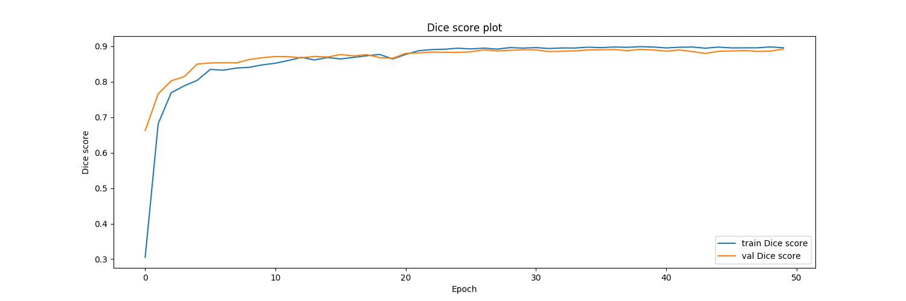
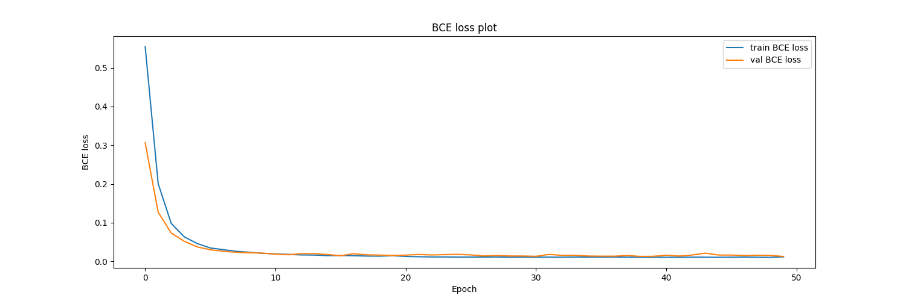
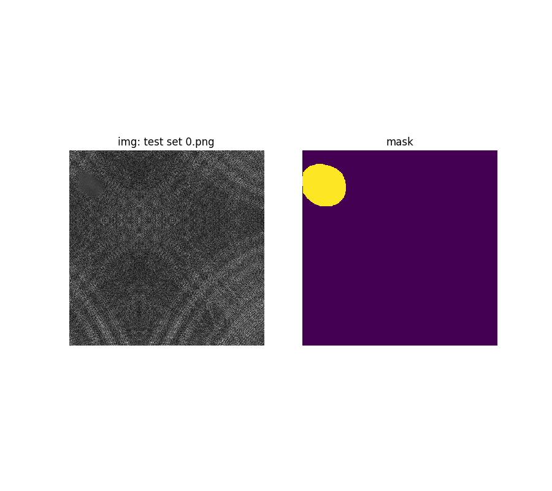

## 缺陷检测

> 比赛地址： https://god.yanxishe.com/80

### 1. Run

```shell
sh run.sh
```

### 2. Experiments

#### Model architecture: Unet   

> data augmentation: Random Flip + Random Gridshuffle(3*3)

| backbone        | score   |
| --------------- | ------- |
| efficientnet-b8 | 89.2113 |
| efficientnet-b7 | 88.3713 |
| efficientnet-b6 | 87.1669 |
| efficientnet-b5 | 87.674  |
| efficientnet-b4 | 88.3498 |
| efficientnet-b3 | 87.8057 |
| efficientnet-b2 | -       |
| efficientnet-b1 | -       |
| efficientnet-b0 | -       |

#### Visualization(b8)







### 3. ensemble

1. 对于不同的backbone(b0 - b8)训练出的模型进行预测，取平均值；

2. TTA  (水平翻转，垂直翻转)


### ACKNOWLEDGEMENTS

https://github.com/qubvel/segmentation_models.pytorch

https://www.kaggle.com/artgor/segmentation-in-pytorch-using-convenient-tools